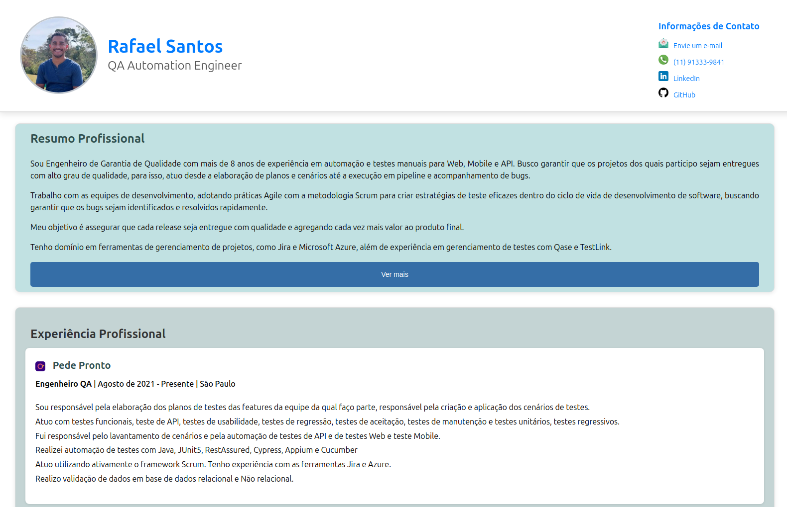

# Projeto curriculum online em react

Implementação em Dispositivos móveis:

<figure>
  
</figure>

Implementação em em computadores:

<figure>
  
</figure>

# Para executar o projeto

Clone o projeto em sua máquina.

No diretório do projeto, execute: npm start
